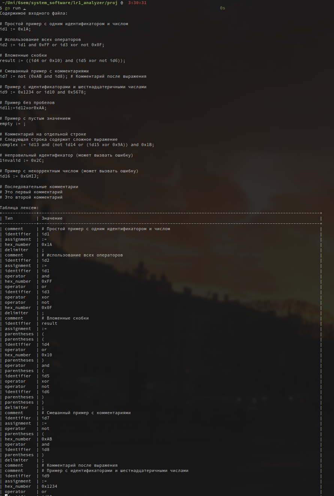
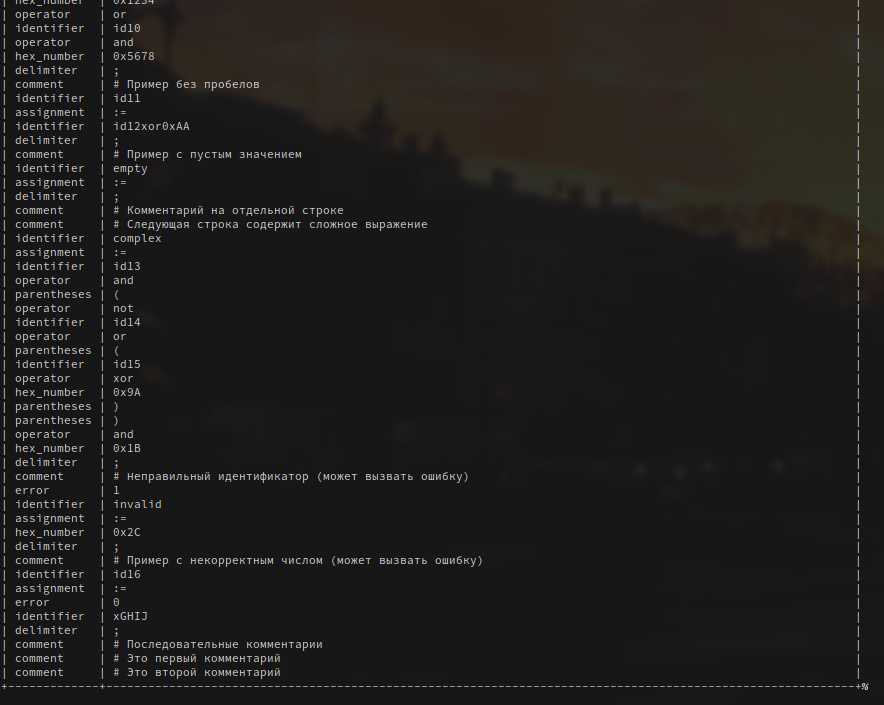

# Цель работы:

Изучение основных понятий теории регулярных языков и грамматик, ознакомление с назначением и
принципами работы конечных автоматов (КА) и лексических анализаторов (сканеров).
Получение практических навыков построения КА на основе заданной регулярной грамматики.
Получение практических навыков построения сканера на примере заданного простейшего входного языка. 

# Задание

Для выполнения лабораторной работы требуется написать программу, которая выполняет
лексический анализ входного текста в соответствии с заданием и порождает таблицу
лексем с указанием их типов и значений.

Текст на входном языке задается в виде символьного (текстового) файла.

Программа должна выдавать сообщения о наличие во входном тексте ошибок, которые могут быть
обнаружены на этапе лексического анализа.

Наличие синтаксических ошибок проверять не требуется.

Длину идентификаторов и строковых констант можно считать ограниченной 32 символами.

Программа должна допускать наличие комментариев неограниченной длины во входном файле.

Форму организации комментариев предлагается выбрать самостоятельно.

Любые лексемы, не предусмотренные вариантом задания, встречающиеся в исходном тексте, должны
трактоваться как ошибочные. 

# Индивидуальное задание

**Вариант**: 14

Входной язык содержит логические выражения, разделенные символом ; (точка с запятой). 
Логические выражения состоят из идентификаторов, шестнадцатеричных чисел, знака присваивания (:=),
знаков операций or, xor, and, not и круглых скобок.

# Ход работы:

## Описание регулярной грамматики

**Разделитель**: ";"

**Идентификатор**: "\[a-zA-Z]\[a-zA-Z0-9]"

**Оператор**: "or|xor|and|not"

**Присваивание**: ":="

**Шестнадцатиричные числа**: "0x\[0-9A-Fa-f]+"

**Комментарии**: "#.*"

**Скобки**: "\[()]"

## Граф переходов для распознавания лексем

Граф определения лексем:

```{ .plantuml caption="asdf"}

@startuml
[*] --> Start

Start --> Identifier : [a-zA-Z][a-zA-Z0-9]* (Идентификатор)
Start --> HexNumber : 0x[0-9A-Fa-f]+ (Шестнадцатеричное число)
Start --> Assignment : := (Присваивание)
Start --> Operator : or|xor|and|not (Логический оператор)
Start --> OpenBracket : ( (Открывающая скобка)
Start --> CloseBracket : ) (Закрывающая скобка)
Start --> Semicolon : ; (Разделитель)
Start -[#red]-> Error : [Другие символы]
Start -[#gray]-> Comment : ~#.* (Комментарий)

Identifier --> Operator : or|xor|and|not
Identifier --> Assignment : :=
Identifier --> CloseBracket
Identifier -[#red]-> Error : [Другие символы]

HexNumber --> Operator : or|xor|and|not
HexNumber --> Semicolon : ;
HexNumber --> CloseBracket
HexNumber -[#red]-> Error : [Другие символы]

Assignment --> Identifier
Assignment --> HexNumber
Assignment --> OpenBracket
Assignment -[#red]-> Error : [Другие символы]

Operator --> Identifier
Operator --> HexNumber
Operator --> OpenBracket
Operator -[#red]-> Error : [Другие символы]

OpenBracket --> Identifier
OpenBracket --> HexNumber
OpenBracket --> OpenBracket
OpenBracket -[#red]-> Error : [Другие символы]

CloseBracket --> Operator
CloseBracket --> CloseBracket
CloseBracket --> Semicolon
CloseBracket -[#red]-> Error : [Другие символы]

Comment -[#gray]-> [*] : Игнорировать строку (до конца строки)

Semicolon --> [*]

Error --> [*] : [Ошибка]
@enduml
```

## Разработка программы

Для разработки программы был выбран язык Golang.

Алгоритм разработанной программы таков: сперва мы читаем входной файл, далее разбиваем его на строки и для каждой строки в цикле обрезаем пробельные символы по краям, проверяем строку на непустоту и пытаемся найти лексему, в случае, если в строке найдена лексема, подходящая под один из заранее определённых шаблонов, она добавляется в таблицу лексем, если же не по одному из шаблонов не было найдено лексем с начала строки, в таблицу добавляется лексема ошибки. Далее обработанная лексема вырезается из обрабатываемой строки и мы возвращаемся к обрезанию пробельных символов. Процесс повторяется пока строка не окажется пустой. Этот алгоритм повторяется для каждой строки файла, после чего полученная таблица выводится в стандартный выход программы.

## Текст программы


~~~{include=proj/main.go .golang caption="main.go"}
~~~

~~~{include=proj/token/token.go .golang caption="token/token.go"}
~~~

~~~{include=proj/token_patterns.go .golang caption="token_patterns.go"}
~~~

~~~{include=proj/token_table.go .golang caption="token_table.go"}
~~~

## Демонстрация работы программы:





# Вывод: 

Изучены основные понятия теории регулярных языков и грамматик, ознакомился с назначением и принципами работы конечных автоматов (КА) и лексических анализаторов (сканеров). Получены практические навыки построения КА на основе заданной регулярной грамматики. Получены практические навыки построения сканера на примере заданного простейшего входного языка. 


