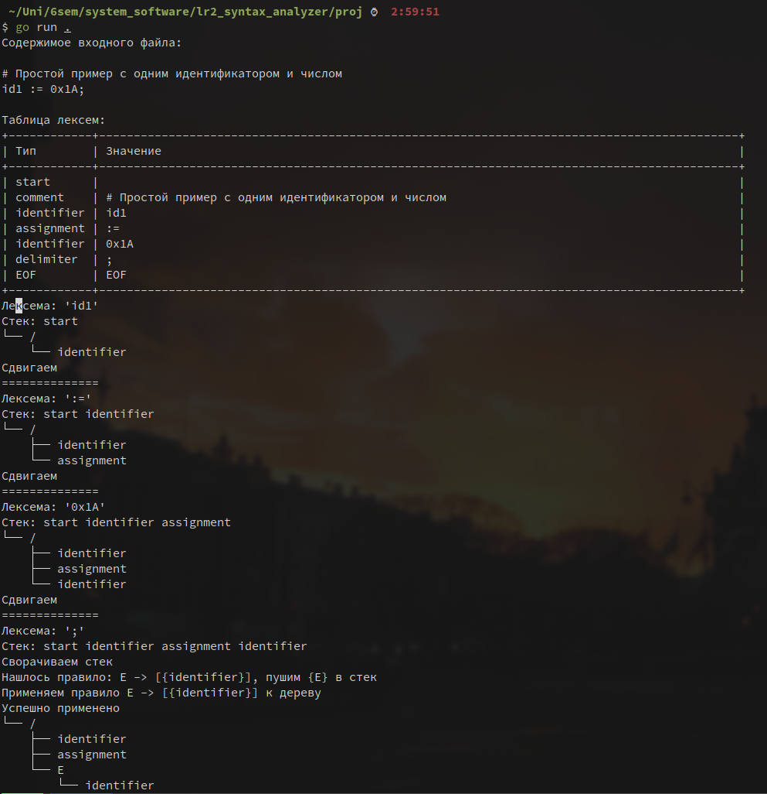
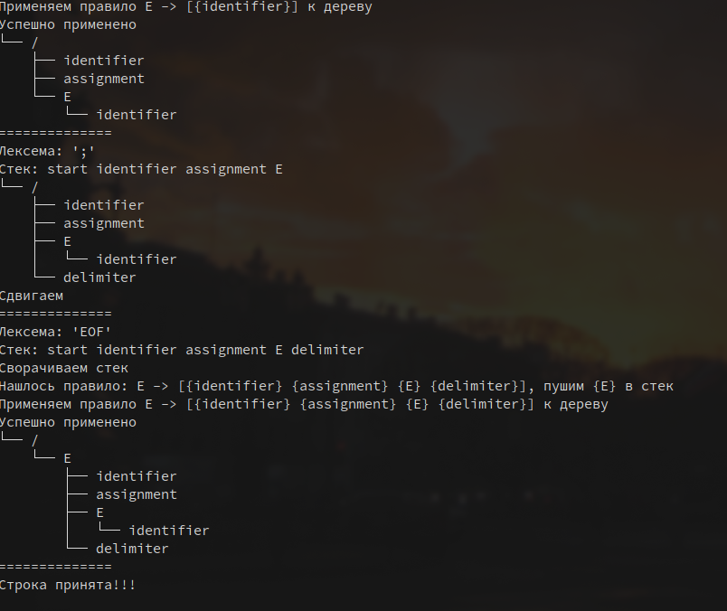
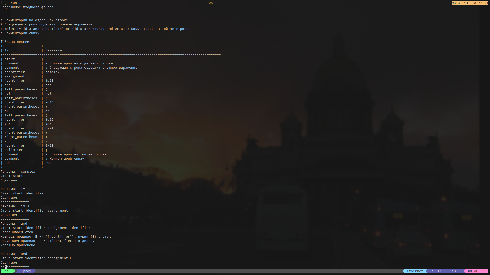
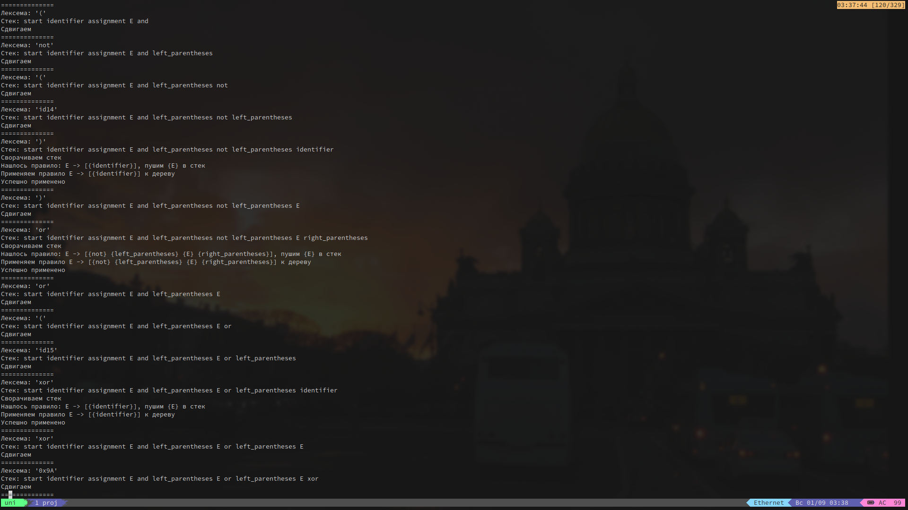
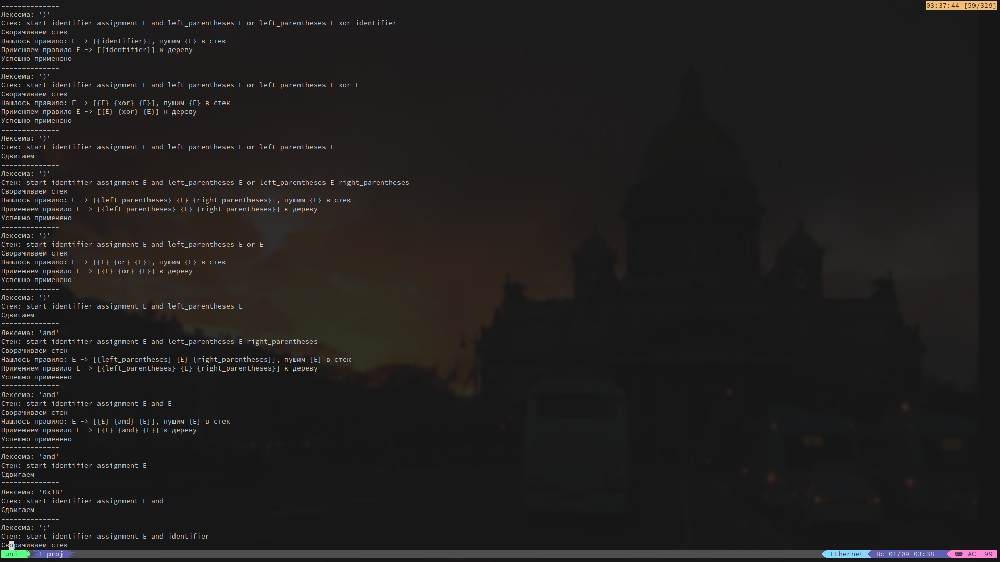
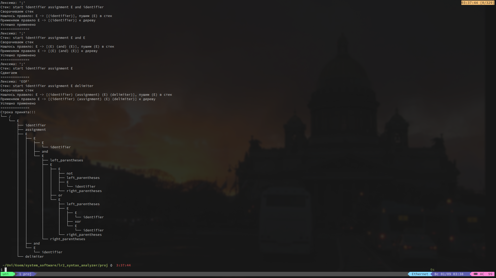
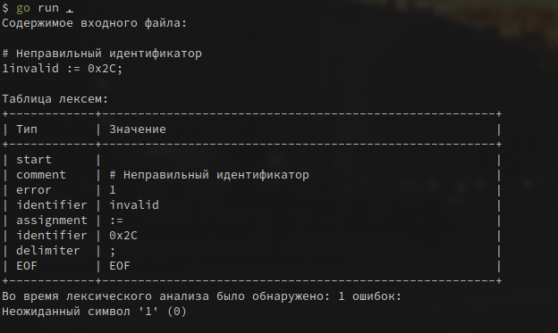
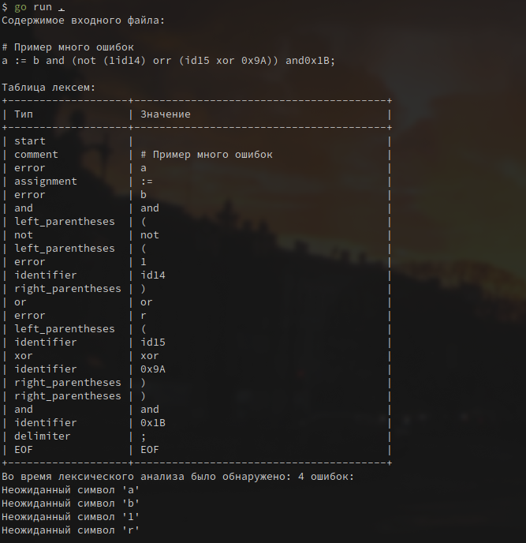
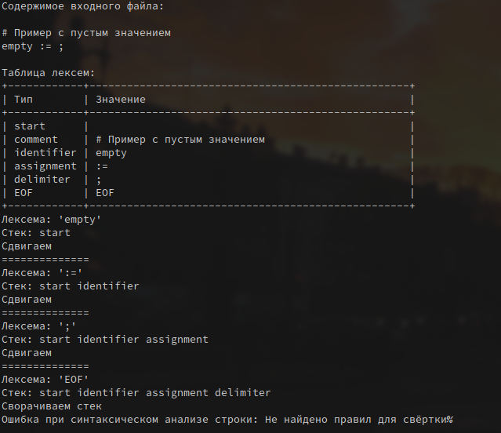
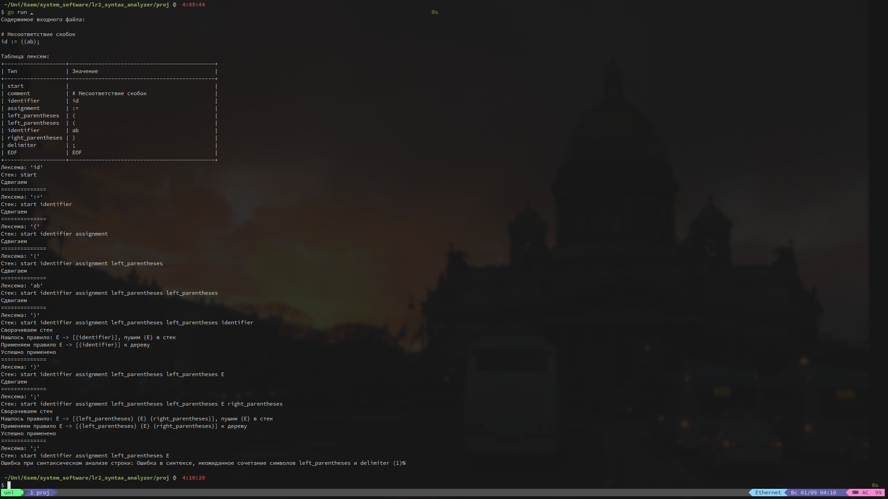

# Цель работы:

Изучение основных понятий теории грамматик простого и операторного предшествования, ознакомление с алгоритмами
синтаксического анализа (разбора) для некоторых классов КС-грамматик, получение практических навыков создания
простейшего синтаксического анализатора для заданной грамматики операторного предшествования. 

Получение практических навыков создания простейшего синтаксического анализатора для заданной грамматики операторного предшествования, обработка и представление результатов синтаксического анализа.

# Задание

Требуется написать программу, которая выполняет лексический анализ входного текста в соответствии с заданием,
порождает таблицу лексем и выполняет синтаксический разбор текста по заданной грамматике.
Текст на входном языке задается в виде символьного (текстового) файла.
Допускается исходить из условия, что текст содержит не более одного предложения входного языка. 

# Индивидуальное задание

Вариант: 14

Вариант грамматики: 2

$$
S \rightarrow \mathbf{a :=} F \mathbf{;} \\
$$
$$
F \rightarrow F \text{ or } T \mid F \text{ xor } T \mid T \\
$$
$$
T \rightarrow T \text{ and } E \mid E \\
$$
$$
E \rightarrow (F) \mid \text{not } (F) \mid a \\
$$

Терминальные символы: **a**, **or**, **xor**, **and**, **not**, **(**, **)**

# Выполнение задания

## Построение левых и правых множеств:

### Левые

1. Шаг 1
    1. L(S): a
    2. L(F): F T
    3. L(T): T E
    4. L(E): ( not a
    
2. Результат
    1. L(S): a
    2. L(F): F T E ( not a
    3. L(T): T E ( not a
    4. L(E): ( not a

3. Терминальные
    1. L'(S): a 
    2. L'(F): or xor and ( not a
    3. L'(T): and ( not a
    4. L'(E): ( not a

### Правые

1. Шаг 1
    1. R(S): ;
    2. R(F): T
    3. R(T): E
    4. R(E): ) a
    
2. Результат
    1. R(S): ;
    2. R(F): T E ) a
    3. R(T): E ) a
    4. R(E): ) a

3. Терминальные
    1. R'(S): ;
    2. R'(F): or xor and ) a
    3. R'(T): and ) a
    4. R'(E): ) a

## Матрица предшествования

<!--LTeX: enabled=false-->
|    | a | := | ( | ) | not | or | xor | and | ; |
|----|---|----|---|---|-----|----|-----|-----|---|
| a  |   | =  |   | > |     | >  |  >  |  >  | > |
| := | < |    | < | < |  <  | <  |  <  |  <  | = |
| (  | < |    | < | = |  <  | <  |  <  |  <  |   |
| )  |   |    |   | > |     | >  |  >  |  >  | > |
| not|   |    | = |   |     |    |     |     |   |
| or | < |    | < | > |  <  | >  |  >  |  <  | > |
| xor| < |    | < | > |  <  | >  |  >  |  <  | > |
| and| < |    | < | > |  <  | >  |  >  |  >  | > |
| ;  |   |    |   |   |     |    |     |     |   |

: Матрица предшествования
<!--LTeX: enabled=true-->

## Пример разбора простейшего предложения 

Предложение: `a := 0xFFF and (b or c);`
<!--LTeX: enabled=false-->
| Входная строка            | Стек                    | Действие     |
|:--------------------------| ---------------------   | ------------:|
| a := a and (a or a); к    |  н                      |  п           | 
| := a and (a or a); к      |  н a                    |  п           | 
| a and (a or a); к         |  н a:=                  |  п           | 
| and (a or a); к           |  н a:=a                 |  с           | 
| and (a or a); к           |  н a:=E                 |  п           | 
| (a or a); к               |  н a:=E and             |  п           | 
| a or a); к                |  н a:=E and (           |  п           | 
| or a); к                  |  н a:=E and ( a         |  п           | 
| or a); к                  |  н a:=E and ( E         |  c           | 
| a); к                     |  н a:=E and ( E or      |  п           | 
| ); к                      |  н a:=E and ( E or a    |  п           | 
| ); к                      |  н a:=E and ( E         |  c           | 
| ; к                       |  н a:=E and (E)         |  c           | 
| ; к                       |  н a:=E and E           |  c           | 
| к                         |  н a:=E;                |  c           | 
| к                         |  н E                    |  -           | 

: Пример разбора простейшего предложения
<!--RTeX: enabled=true-->

## Построение дерева вывода для простейшего примера

Предложение: `a := 0xFFF and (b or c);`

E -> a :=E; -> a :=E and E; -> a :=E and (E); -> a := E and (E or a); -> a := E and (a or a); -> a := a and (a or a);

```{ .plantuml caption="Дерево вывода" }
@startmindmap дерево вывода

* E
** a
** :=
** E
*** E
**** a
*** and
*** E
**** ( 
**** E
***** E
****** a
***** or
***** a
**** )
** ;

@endmindmap
```

## Составление программы

## Примеры работы программы

### Простое предложение

```
# Простой пример с одним идентификатором и числом
id1 := 0x1A;
```





### Сложное предложение

```
# Комментарий на отдельной строке
# Следующая строка содержит сложное выражение
complex := id13 and (not (id14) or (id15 xor 0x9A)) and 0x1B; # Комментарий на той же строке
# Комментарий снизу
```









### Примеры с ошибками

#### Ошибка на этапе лексического анализа

```
# Неправильный идентификатор 
1invalid := 0x2C; 
```



```
# Пример много ошибок
a := b and (not (1id14) orr (id15 xor 0x9A)) and0x1B;
```



#### Ошибка на этапе синтаксического анализа

```
# Пример с пустым значением
empty := ; 
```



```
# Несоответствие скобок
id := ((ab);
```



# Вывод

Изучены основные понятия теории грамматик простого и операторного предшествования, ознакомился с алгоритмами синтаксического анализа (разбора) для некоторых классов КС-грамматик, получены практические навыки создания простейшего синтаксического анализатора для заданной грамматики операторного предшествования. 

Получены практические навыки создания простейшего синтаксического анализатора для заданной грамматики операторного предшествования, обработи и представления результатов синтаксического анализа.
